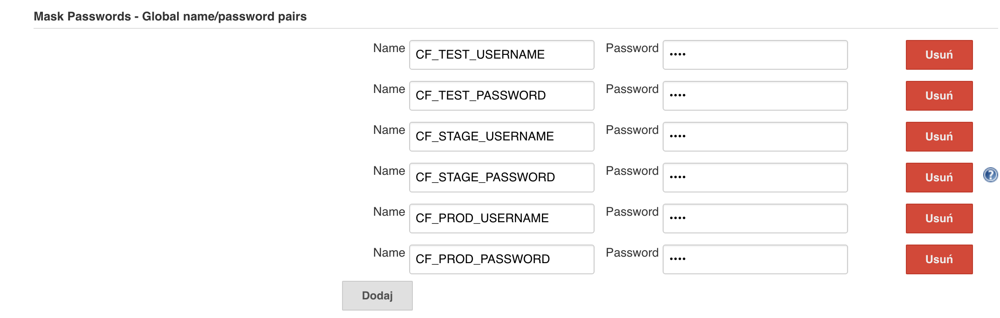

= Jenkins DSL Pipeline

The repository contains job definitions using https://wiki.jenkins-ci.org/display/JENKINS/Job+DSL+Plugin[Jenkins Job Dsl plugin]. Those jobs will form an empty pipeline and a sample, opinionated one that you can use in your company.

The projects that take part in the whole setup are:

- https://github.com/dsyer/github-analytics[Github-Analytics] - the app that has a REST endpoint and uses messaging. Our app under test
- https://github.com/marcingrzejszczak/github-eureka[Eureka] - simple Eureka Server
- https://github.com/marcingrzejszczak/github-analytics-stub-runner-boot[Github Analytics Stub Runner Boot] - Stub Runner Boot server to be used for tests with Github Analytics. Uses Eureka and Messaging.
- https://github.com/marcingrzejszczak/atom-feed[Github Webhook] - project that uses Github-Analytics

== Step by step

- Fork repos
- Start PCF Dev (if you don't want to use an existing one)
- Start Docker Compose with Jenkins + Artifactory
- Setup Jenkins global config
- Add Jenkins credentials for Github
- Add `settings.xml` for Jenkins' master
- Seed job with REPOS to forked projects

=== Fork repos

There are 4 apps that are composing the pipeline

  - https://github.com/marcingrzejszczak/atom-feed[Github Webhook]
  - https://github.com/dsyer/github-analytics/[Github Analytics]
  - https://github.com/marcingrzejszczak/github-eureka[Github Eureka]
  - https://github.com/marcingrzejszczak/github-analytics-stub-runner-boot[Github Stub Runner Boot]

You need to fork them. That's because only then will your user be able to tag and push the tag to repo.

=== Start PCF Dev

TIP: You can skip this step if you have CF installed already

You have to download and start PCF Dev. https://pivotal.io/platform/pcf-tutorials/getting-started-with-pivotal-cloud-foundry-dev/install-pcf-dev[A link how to do it is available here.]

=== Start Docker Compose

Jenkins + Artifactory can be ran locally. To do that just execute

`docker-compose up`

Then Jenkins will be running on port `8080` and Artifactory `8081`.

=== Setup Jenkins global config

==== Global envs

You have to add env vars (go to configure Jenkins -> Global Properties) for the following
 properties (the defaults are for PCF Dev):

[frame="topbot",options="header,footer"]
|======================
|Property Name  | Property Description | PCF Dev value
|CF_TEST_ORG    | Name of the org for the test env |
|CF_TEST_SPACE  | Name of the space for the test env |
|CF_STAGE_ORG   | Name of the org for the stage env |
|CF_STAGE_SPACE | Name of the space for the stage env |
|CF_PROD_ORG   | Name of the org for the prod env |
|CF_PROD_SPACE | Name of the space for the prod env |
|REPO_WITH_JARS | URL to repo with the deployed jars | http://localhost:8081/artifactory/libs-release-local
|M2_SETTINGS_REPO_ID | The id of server from Maven settings.xml | artifactory-local
|======================

Example screen:

image::docs/env_vars.png[]

==== Masked passwords

Provide masked passwords in a similar manner (the defaults are for PCF Dev):

[frame="topbot",options="header,footer"]
|======================
|Property Name  | Property Description | PCF Dev value
|CF_TEST_USERNAME    | Username for test env for Cloud Foundry | user
|CF_TEST_PASSWORD  | Password for test env for Cloud Foundry | pass
|CF_STAGE_USERNAME   | Username for test env for Cloud Foundry | user
|CF_STAGE_PASSWORD | Password for test env for Cloud Foundry | pass
|CF_PROD_USERNAME   | Username for test env for Cloud Foundry | user
|CF_PROD_PASSWORD | Password for test env for Cloud Foundry | pass
|======================

Example screen:

==== Additional setup

Enable Groovy Token Macro Processing to allow generation of Pipeline Version

image::docs/groovy_token.png[]

=== Add Jenkins credentials for Github

== How to build it

`./gradlew clean build`

WARNING: The ran test only checks if your scripts compile.

== How to use it in Jenkins?

Check out the https://github.com/jenkinsci/job-dsl-plugin/wiki/Tutorial---Using-the-Jenkins-Job-DSL[tutorial].
Provide the link to this repository in your Jenkins installation.

The seed job for Spring Cloud should scan the `jobs/springcloud/*.groovy` files.

Remember to add `src/main/groovy` and `src/main/resources` for processing

WARNING: Remember that views can be overridden that's why the suggestion is to contain in one script all the logic needed to build a view
 for a single project (check out that `spring_cloud_views.groovy` is building all the `spring-cloud` views).
