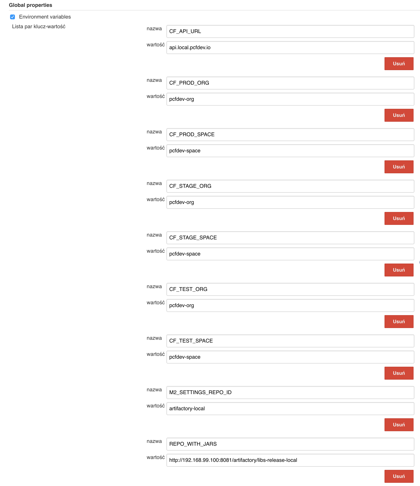
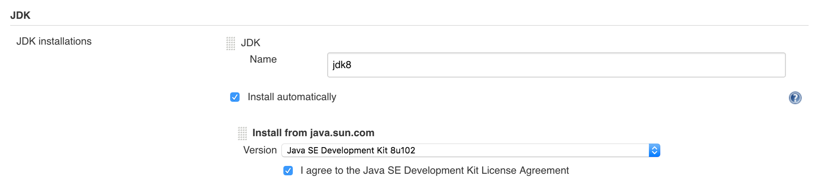
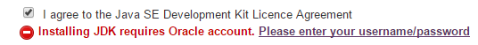
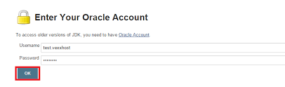

= Jenkins DSL Pipeline

The repository contains job definitions using https://wiki.jenkins-ci.org/display/JENKINS/Job+DSL+Plugin[Jenkins Job Dsl plugin]. Those jobs will form an empty pipeline and a sample, opinionated one that you can use in your company.

The projects that take part in the whole setup are:

- https://github.com/dsyer/github-analytics[Github-Analytics] - the app that has a REST endpoint and uses messaging. Our app under test
- https://github.com/marcingrzejszczak/github-eureka[Eureka] - simple Eureka Server
- https://github.com/marcingrzejszczak/github-analytics-stub-runner-boot[Github Analytics Stub Runner Boot] - Stub Runner Boot server to be used for tests with Github Analytics. Uses Eureka and Messaging.
- https://github.com/marcingrzejszczak/atom-feed[Github Webhook] - project that uses Github-Analytics

== Step by step

- Fork repos
- Start PCF Dev (if you don't want to use an existing one)
- Start Docker Compose with Jenkins + Artifactory
- Setup Jenkins env vars (if you want to use the demo defaults and you're using Docker Machine
just check out the section on how to update the URL to Artifactory)
- Setup Jenkins miscs (JDK installation, Groovy macro processing etc.)
- Setup Jenkins credentials
- Add `settings.xml` for Jenkins' master (you can skip this if you want to use our defaults)
- Run the seed job
- Run the `github-webhook` pipeline

=== Fork repos

There are 4 apps that are composing the pipeline

  - https://github.com/marcingrzejszczak/atom-feed[Github Webhook]
  - https://github.com/dsyer/github-analytics/[Github Analytics]
  - https://github.com/marcingrzejszczak/github-eureka[Github Eureka]
  - https://github.com/marcingrzejszczak/github-analytics-stub-runner-boot[Github Stub Runner Boot]

You need to fork only these. That's because only then will your user be able to tag and push the tag to repo.

  - https://github.com/marcingrzejszczak/atom-feed[Github Webhook]
  - https://github.com/dsyer/github-analytics/[Github Analytics]

For the other two

  - https://github.com/marcingrzejszczak/github-eureka[Github Eureka]
  - https://github.com/marcingrzejszczak/github-analytics-stub-runner-boot[Github Stub Runner Boot]

You have to build locally and upload their artifacts to Artifactory.

==== Set up your local Maven to work with Artifactory

First, you have to ensure that this section is present under your `~/.m2/settings.xml`

[source,xml]
----
<server>
  <id>artifactory-local</id>
  <username>admin</username>
  <password>password</password>
</server>
----

If you don't have this file just copy the one under `seed/settings.xml` or copy paste it from below

[source,xml]
----
include::seed/settings.xml[]
----

==== Deploy the infra JARs

If you're running without Docker Machine

Github Eureka:

[source,bash]
----
git clone https://github.com/marcingrzejszczak/github-eureka
cd github-eureka
./mvnw clean deploy
----

Github Stub Runner:

[source,bash]
----
git clone https://github.com/marcingrzejszczak/github-analytics-stub-runner-boot
cd github-analytics-stub-runner-boot
./mvnw clean deploy
----

If you're running with Docker Machine (e.g. Docker Machine running on 192.168.99.100):

Github Eureka:

[source,bash]
----
git clone https://github.com/marcingrzejszczak/github-eureka
cd github-eureka
./mvnw clean deploy -Ddistribution.management.release.url=http://192.168.99.100:8081/artifactory/libs-release-local
----

Github Stub Runner:

[source,bash]
----
git clone https://github.com/marcingrzejszczak/github-analytics-stub-runner-boot
cd github-analytics-stub-runner-boot
./mvnw clean deploy -Ddistribution.management.release.url=http://192.168.99.100:8081/artifactory/libs-release-local
----

=== Start PCF Dev

TIP: You can skip this step if you have CF installed already

You have to download and start PCF Dev. https://pivotal.io/platform/pcf-tutorials/getting-started-with-pivotal-cloud-foundry-dev/install-pcf-dev[A link how to do it is available here.]

The default credentials when using PCF Dev are:

[source,bash]
----
username: user
password: pass
email: user
org: pcfdev-org
space: pcfdev-space
api: api.local.pcfdev.io
----

You can start the PCF dev with more memory

[source,bash]
----
cf dev start
----

You'll have to create 3 separate spaces (email admin, pass admin)

[source,bash]
----
cf login -a https://api.local.pcfdev.io --skip-ssl-validation -u admin -p admin -o pcfdev-org

cf create-space pcfdev-test
cf set-space-role user pcfdev-org pcfdev-test SpaceDeveloper
cf create-space pcfdev-stage
cf set-space-role user pcfdev-org pcfdev-stage SpaceDeveloper
cf create-space pcfdev-prod
cf set-space-role user pcfdev-org pcfdev-prod SpaceDeveloper
----

IMPORTANT: Most likely you will run out of memory so when reaching the stage
environment it's good to kill all apps on test. You can do it like this:

E.g. for `github-webhook` app

[source,bash]
----
cf target -o pcfdev-org -s pcfdev-test
cf stop github-webhook
cf stop github-eureka
cf stop stubrunner
----

=== Start Docker Compose

Jenkins + Artifactory can be ran locally. To do that just execute

`docker-compose up`

Then Jenkins will be running on port `8080` and Artifactory `8081`.

=== Setup Jenkins env vars

TIP: If you want to only play around with the demo that we've prepared
you can skip this section and use our defaults.

IMPORTANT: If you're using a docker-machine then for sure you have to update
 the `REPO_WITH_JARS` to point to your Docker Machine address e.g. `192.168.99.100`
 instead of `localhost`

IMPORTANT: If you're choosing the global envs, you *HAVE* to remove the other approach
(e.g. if you set the global env for `REPO_WITH_JARS`, please remove that property in the
seed job

==== Global envs

You can add env vars (go to configure Jenkins -> Global Properties) for the following
 properties (the defaults are for PCF Dev):

Example screen:

==== Seed properties

Another approach is to run the seed job with parameters / env vars. Whatever
you set will be parsed by the seed job and passed to the generated Jenkins
jobs.

TIP: This is very useful when the repos you want to build differ. E.g. use
different JDK. Then some seeds can set the `JDK_VERSION` param to one version
of Java installation and the others to another one.

Example screen:

image::docs/seed.png[]

In this example we could parametrize the `REPOS` and `REPO_WITH_JARS` params.

==== All env vars

The env vars that are used in all of the jobs are as follows:

[frame="topbot",options="header,footer"]
|======================
|Property Name  | Property Description | Default value
|CF_API_URL | The URL to the CF Api | api.local.pcfdev.io
|CF_TEST_ORG    | Name of the org for the test env | pcfdev-org
|CF_TEST_SPACE  | Name of the space for the test env | pcfdev-space
|CF_STAGE_ORG   | Name of the org for the stage env | pcfdev-org
|CF_STAGE_SPACE | Name of the space for the stage env | pcfdev-space
|CF_PROD_ORG   | Name of the org for the prod env | pcfdev-org
|CF_PROD_SPACE | Name of the space for the prod env | pcfdev-space
|REPO_WITH_JARS | URL to repo with the deployed jars | http://localhost:8081/artifactory/libs-release-local
|M2_SETTINGS_REPO_ID | The id of server from Maven settings.xml | artifactory-local
|JDK_VERSION | The name of the JDK installation | jdk8
|======================

=== Additional setup

==== Enable Groovy Token Macro Processing

you need this to allow generation of Pipeline Version

image::docs/groovy_token.png[]

==== Provide your JDK version

- by default we assume that you have jdk with id `jdk8` configured
- if you want a different one just override `JDK_VERSION` env var and point to the proper one

To set the default one just follow these steps:

{nbsp}
{nbsp}

image::docs/manage_jenkins.png[caption="Step 1: ", title="Click 'Manage Jenkins'"]

{nbsp}
{nbsp}

image::docs/global_tool.png[caption="Step 2: ", title="Click 'Global Tool'"]

{nbsp}
{nbsp}

image::docs/jdk_installation.png[caption="Step 3: ", title="Click 'JDK Installations'"]

{nbsp}
{nbsp}

{nbsp}
{nbsp}

{nbsp}
{nbsp}

{nbsp}
{nbsp}

And that's it!

=== Add Jenkins credentials for GitHub

The scripts will need to access the credentials for Cloud Foundry access.
Additionally there is one that is required in order to tag the repo.

In order for the scripts to find the credentials you have to pass the IDs
of the stored credentials. Below you can find the list of env vars that you
can set in order to find the proper credential. There are of course
some defaults too.

You have to set credentials with ids: `cf-test`, `cf-stage`, `cf-prod`, `git`.

Below you can find instructions on how to set a credential (e.g. for `cf-test` credential).

{nbsp}
{nbsp}

image::docs/credentials_system.png[caption="Step 1: ", title="Click 'Credentials, System'"]

{nbsp}
{nbsp}

image::docs/credentials_global.png[caption="Step 2: ", title="Click 'Global Credentials'"]

{nbsp}
{nbsp}

image::docs/credentials_add.png[caption="Step 3: ", title="Click 'Add credentials'"]

{nbsp}
{nbsp}

image::docs/credentials_example.png[caption="Step 4: ", title="Fill out the user / password and provide the ID (in this example `cf-test`)"]

{nbsp}
{nbsp}

In your scripts we reference the credentials via IDs. These are the defaults for credentials

[frame="topbot",options="header,footer"]
|======================
|Property Name  | Property Description | Default value
|GIT_CREDENTIAL_ID    | Credential ID used to tag a git repo | git
|CF_TEST_CREDENTIAL_ID  | Credential ID for CF Test env access | cf-test
|CF_STAGE_CREDENTIAL_ID   | Credential ID for CF Stage env access | cf-stage
|CF_PROD_CREDENTIAL_ID | Credential ID for CF Prod env access | cf-prod
|======================

If you already have in your system a credential to for example tag a repo
you can use it by passing the value of the property `GIT_CREDENTIAL_ID`

=== Setup settings.xml for Maven deployment

TIP: If you want to use the default connection to the Docker version
of Artifactory you can skip this step

So that `./mvnw deploy` works with Artifactory from Docker we're
already copying the missing `settings.xml` file for you. It looks like this:

[source,xml]
----
<server>
  <id>artifactory-local</id>
  <username>admin</username>
  <password>password</password>
</server>
----

If you want to use your own version of Artifactory / Nexus you have to update
the file (it's in `seed/settings.xml`).

=== Run the seed job

We already create the seed job for you but you'll have to run it. When you do
run it you have to provide some properties. By default we create a seed that
has all the properties options, but you can delete most of it. If you
set the properties as global env variables you have to remove them from the
seed.

Anyways, to run the demo just provide in the `REPOS` var the comma separated
 list of URLs of the 2 aforementioned forks of `github-webhook` and `github-analytics'.

{nbsp}
{nbsp}

image::docs/seed_click.png[caption="Step 1: ", title="Click the 'jenkins-pipeline-seed' job"]

{nbsp}
{nbsp}

image::docs/seed_run.png[caption="Step 2: ", title="Click the 'Build with parameters'"]

{nbsp}
{nbsp}

image::docs/seed.png[caption="Step 3: ", title="Provide the parameters (you'll have more of them)"]

{nbsp}
{nbsp}

image::docs/seed_built.png[caption="Step 4: ", title="This is how the results of seed should look like"]

{nbsp}
{nbsp}

image::docs/seed_views.png[caption="Step 5: ", title="Click the 'github-webhook' view"]

{nbsp}
{nbsp}

image::docs/pipeline_run.png[caption="Step 6: ", title="Run the pipeline"]

{nbsp}
{nbsp}

image::docs/pipeline_run_props.png[caption="Step 7: ", title="You can set some properties (just click 'Build' to proceed) "]

{nbsp}
{nbsp}

image::docs/pipeline_manual.png[caption="Step 8: ", title="Click the manual step to go to stage (remember about killing the apps on test env)"]

{nbsp}
{nbsp}

image::docs/pipeline_finished.png[caption="Step 9: ", title="The full pipeline should look like this"]

=== Run the github-webhook pipeline

We already create the seed job for you but you'll have to run it. When you do
run it you have to provide some properties. By default we create a seed that
has all the properties options, but you can delete most of it. If you
set the properties as global env variables you have to remove them from the
seed.

Anyways, to run the demo just provide in the `REPOS` var the comma separated
 list of URLs of the 2 aforementioned forks of `github-webhook` and `github-analytics'.

== FAQ

=== Pipeline version contains ${PIPELINE_VERSION}

You can check the Jenkins logs and you'll see

[source,bash]
----
WARNING: Skipped parameter `PIPELINE_VERSION` as it is undefined on `jenkins-pipeline-sample-build`.
	Set `-Dhudson.model.ParametersAction.keepUndefinedParameters`=true to allow undefined parameters
	to be injected as environment variables or
	`-Dhudson.model.ParametersAction.safeParameters=[comma-separated list]`
	to whitelist specific parameter names, even though it represents a security breach
----

To fix it you have to do exactly what the warning suggests...

=== Can I use the pipeline for some other repos?

Sure! you can pass `REPOS` variable with comma separated list of
`project_name$project_url` format. If you don't provide the PROJECT_NAME the
repo name will be extracted and used as the name of the project.

E.g. for `REPOS` equal to:

`https://github.com/dsyer/github-analytics,https://github.com/marcingrzejszczak/atom-feed`

will result in the creation of pipelines with root names `github-analytics` and `atom-feed`.

E.g. for `REPOS` equal to:

`foo$https://github.com/dsyer/github-analytics,bar$https://github.com/marcingrzejszczak/atom-feed`

will result in the creation of pipelines with root names `foo` for `github-analytics`
and `bar` for `atom-feed`.

=== I've ran out of resources!!

When deploying the app to stage or prod you can get an exception `Insufficient resources`. The way to
 solve it is to kill some apps from test / stage env. To achieve that just call

[source,bash]
----
cf target -o pcfdev-org -s pcfdev-test
cf stop github-webhook
cf stop github-eureka
cf stop stubrunner
----

== How to build it

`./gradlew clean build`

WARNING: The ran test only checks if your scripts compile.

== How to use it in Jenkins?

Check out the https://github.com/jenkinsci/job-dsl-plugin/wiki/Tutorial---Using-the-Jenkins-Job-DSL[tutorial].
Provide the link to this repository in your Jenkins installation.

The seed job should scan the `jobs/jenkins_pipeline_sample*.groovy` files.

Remember to add `src/main/groovy` and `src/main/resources` for processing

WARNING: Remember that views can be overridden that's why the suggestion is to contain in one script all the logic needed to build a view
 for a single project (check out that `spring_cloud_views.groovy` is building all the `spring-cloud` views).
